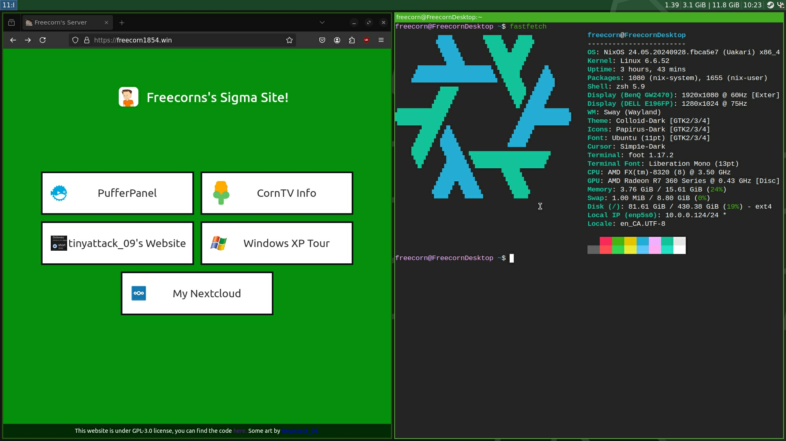

# Freecorn's Desktop NixOS Config!

This config is the main configuration i use for NixOS, some stuff has been copied or based off of jimbos configuration
https://git.jimbosfiles.com/Jimbo/NixOS-Config and Jimbo has been a big help in helping setting things up.

### this repo is at a point that i feel like its ready to be public.
#### if you are on jimbosfiles.com, a clone of this repo can be found on github: https://github.com/Freecorn1854/freecorn-nixos-config

#### if you are on github.com, a clone of this repo can be found on jimbosfiles.com: https://git.jimbosfiles.com/Freecorn1854/desktop-nixos-config

Screenshot as of Oct 8th 2024.
