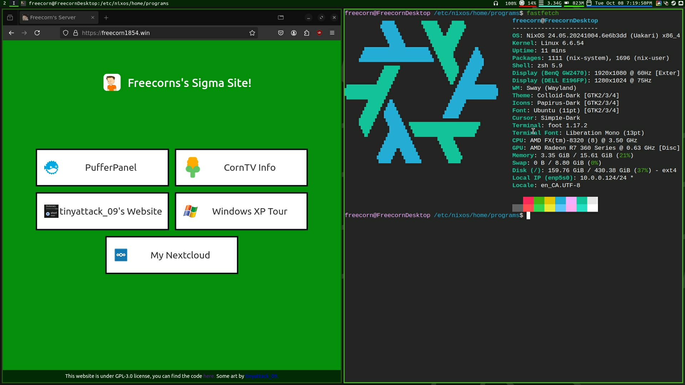

# Freecorn's Desktop NixOS Config!

This config is the main configuration i use for NixOS, some stuff has been copied or based off of jimbos configuration
https://git.jimbosfiles.com/Jimbo/NixOS-Config and Jimbo has been a big help in helping setting things up.

### this repo is at a point that i feel like its ready to be public.

